# Chapter 29: The Porch

*(POV: Justin)*

<figure>
  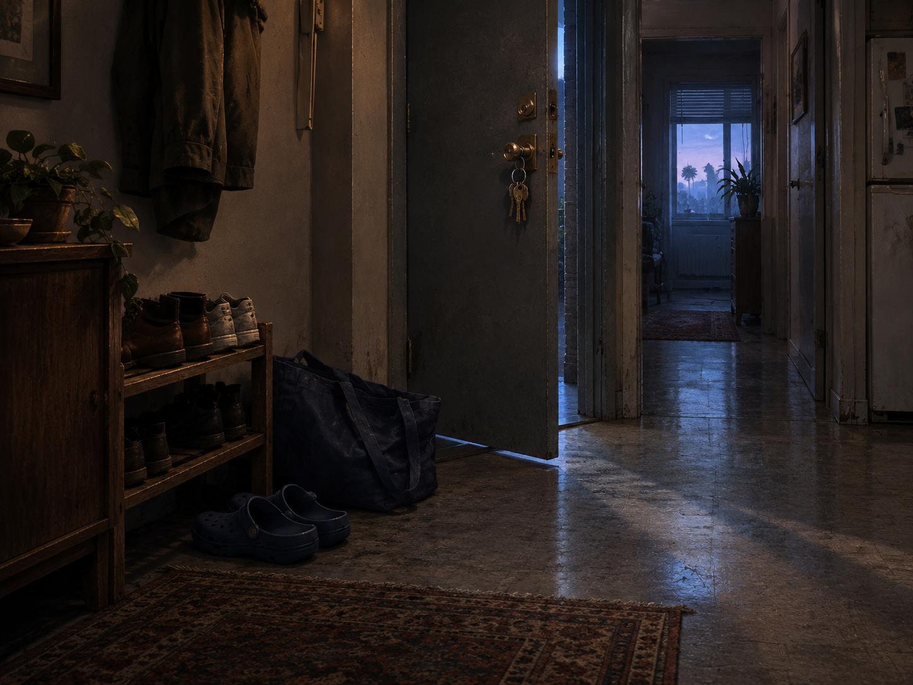
</figure>
The key turned in the front door lock at twenty to six in the morning.

<figure>
  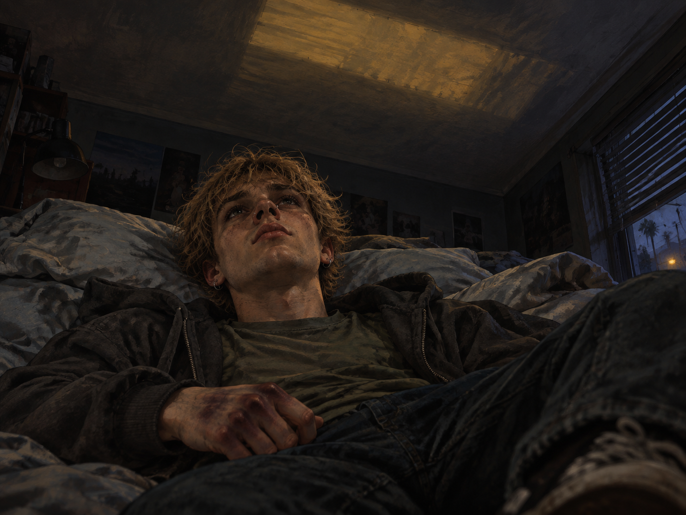
</figure>
I was already awake. I had spent eight hours staring at the faint rectangle of light that the streetlamp cast across my ceiling, counting the hums of the refrigerator compressor and listening to the occasional truck rattle down the boulevard. Every time I closed my eyes, the sound of my fist hitting Marcus's jaw played back with sickening clarity, followed by Samira's voice in my kitchen: *Three stitches inside his mouth. He told Davies he slipped on chocolate milk.*

<figure>
  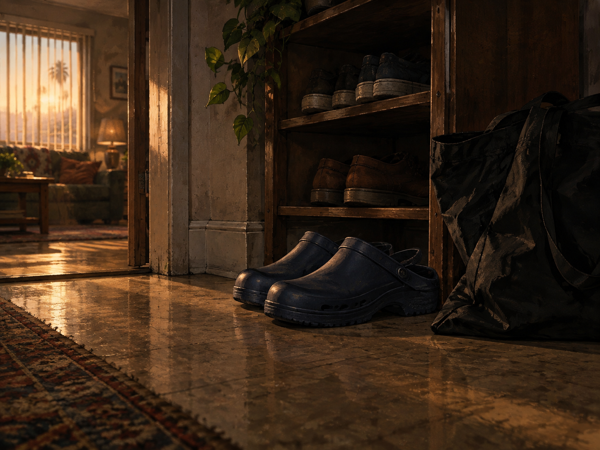
</figure>
The front door clicked shut. Footsteps moved across the entryway linoleum. My mom kicked off her support clogs by the shoe rack, the heavy rubber thudding against the baseboard. She had been on her feet in the urgent care triage unit for fourteen hours straight.

<figure>
  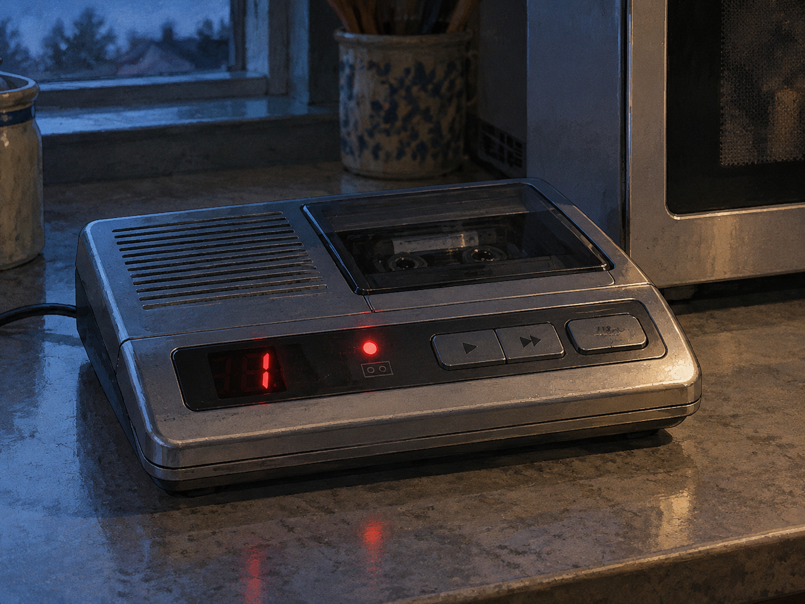
</figure>
I heard the rustle of her nylon tote bag dropping onto the kitchen counter. Then came the short, sharp beep.

<figure>
  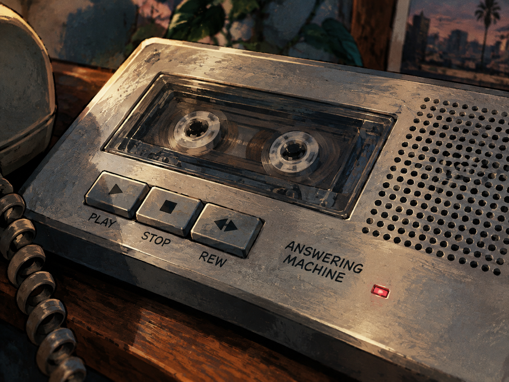
</figure>
The answering machine sat next to the microwave. It was a silver plastic box with a red digital display. Whenever an unplayed message waited, a red LED flashed once every two seconds. In the quiet morning, the mechanical click of the tape relay sounded like a starter pistol.

*“You have one new message. Message received Monday, two-fifteen PM.”*

A brief hiss of static. Then Vice Principal Davies's voice filled the kitchen, flat and bureaucratic.

*“Mrs. Herrera, this is Vice Principal Davies from West Valley High School. I am calling to inform you of an administrative disciplinary action regarding your son, Justin. Following an incident in the cafeteria during fourth period today, Justin has been assigned a three-day out-of-school suspension for physical aggression. He is not permitted on school grounds through Thursday. I request that you contact my office at your earliest convenience to schedule a re-entry conference for Friday morning. Thank you.”*

The machine beeped twice and rewound.

<figure>
  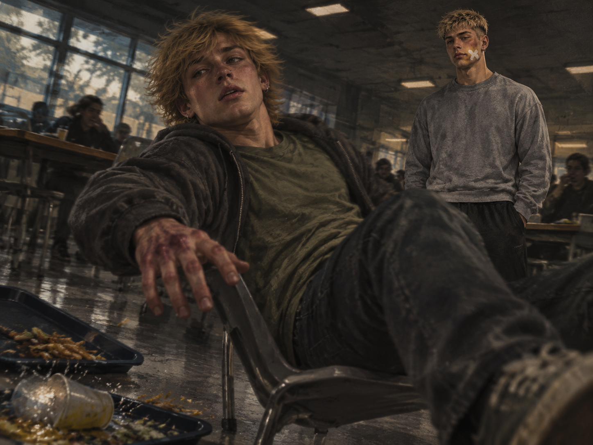
</figure>
The silence that settled over the apartment was absolute.

<figure>
  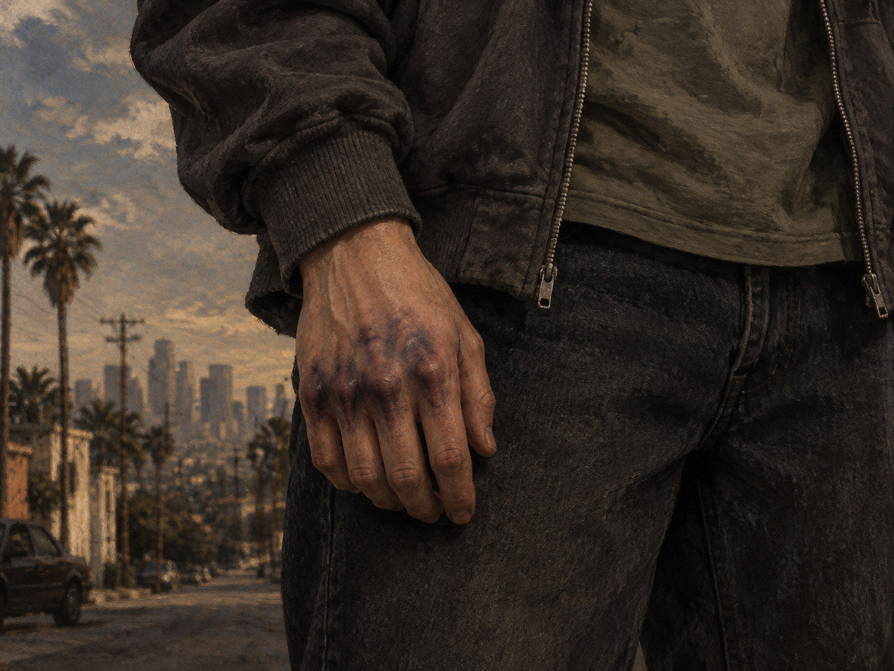
</figure>
I pulled myself up from the mattress. My joints felt stiff, and my right hand gave a sharp, thumping pulse the moment I let it hang down. The knuckles were mottled with dark purple bruising, though the frozen peas had at least brought the swelling down enough that I could bend my fingers halfway.

<figure>
  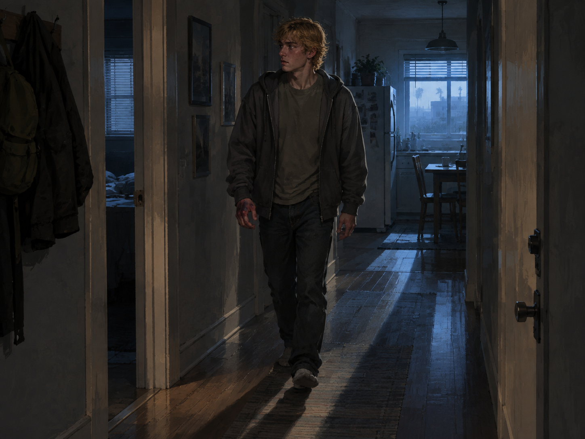
</figure>
I walked down the hallway in my socks.

<figure>
  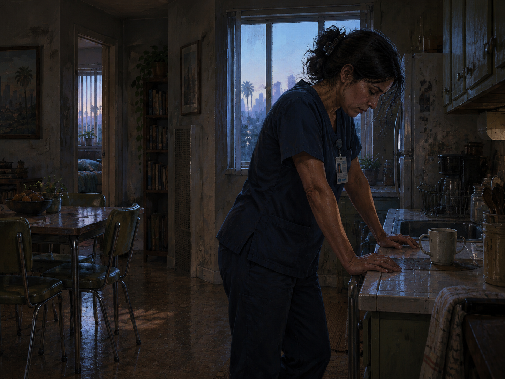
</figure>
My mom was standing by the counter with her hospital badge clipped to her navy scrubs. Her shoulders curved inward with the heavy, deadening fatigue that always followed a night shift. She had not turned on the kitchen light; she stood in the blue wash of dawn coming through the window above the sink.

<figure>
  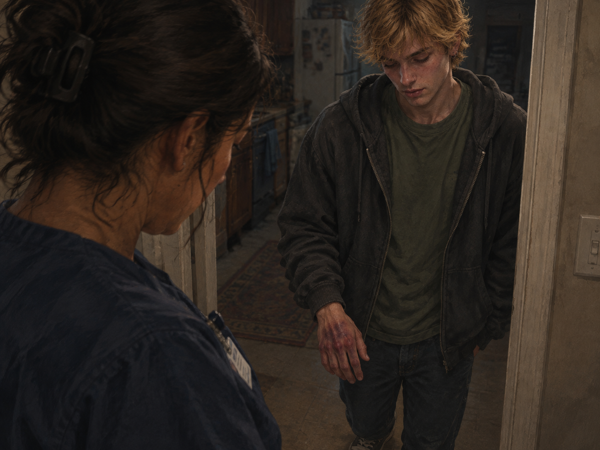
</figure>
She turned her head when my shadow hit the doorframe. Her gaze tracked straight down to my right hand.

"Who was it?" she asked.

Her voice had no anger in it. Anger required energy, and she had none left after a night of holding pressure on lacerations and charting vitals. What she had was a quiet, flat weariness that made my stomach drop harder than shouting ever could.

<figure>
  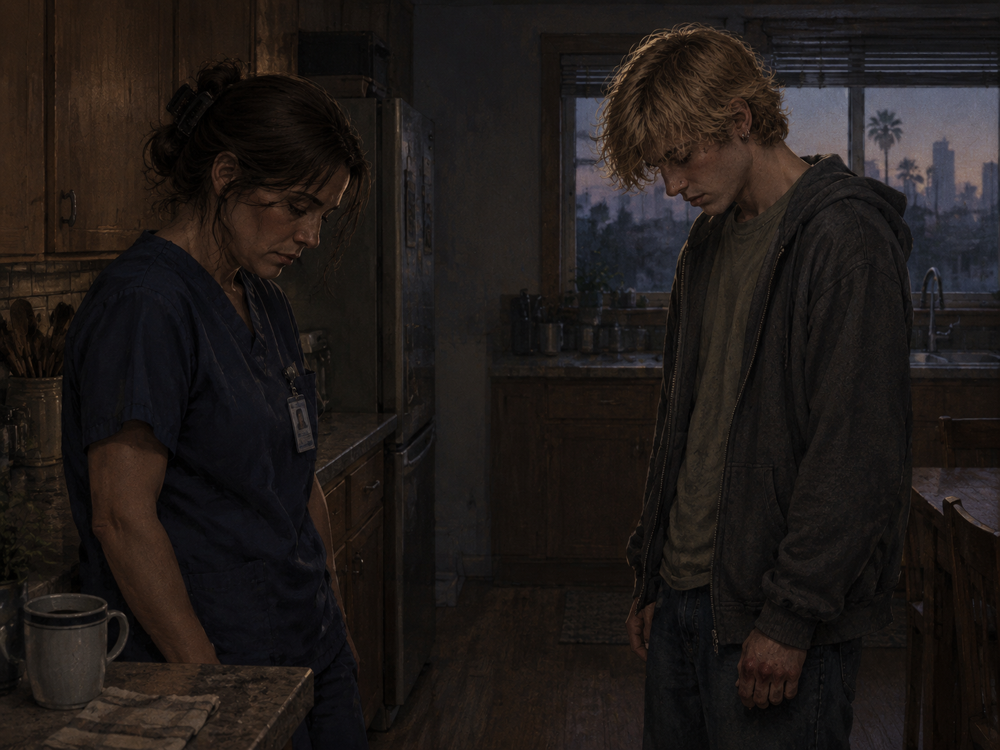
</figure>
"Marcus," I said.

The word hung between us.

<figure>
  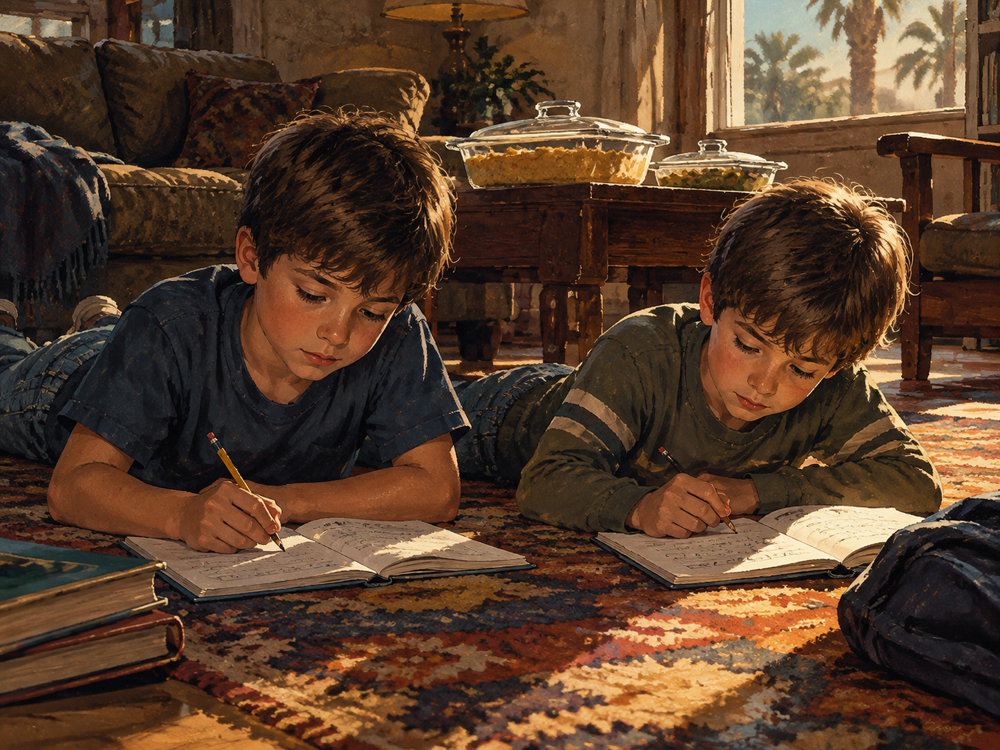
</figure>
My mom blinked once, slowly. Marcus had been sitting at our kitchen table since third grade. When my dad left, Marcus's mom had brought over casseroles; when my mom worked double shifts, Marcus's house was where I did homework on the living room rug.

"Marcus Watts?" she asked.

"Yeah."

"Why?"

I had spent the night searching for explanations, and every single one sounded vile. I could not tell her about the penthouse, or the Tiffany bracelet, or the fact that I had convinced myself my best friend was secretly meeting the boy I liked because I was too cowardly to accept that Andrew simply had an actual partner in Brentwood. To a woman working sixty hours a week to pay our rent, those words were self-indulgent, paranoid trash.

"I thought he did something he didn't do," I said. "I got mad, and I didn't ask questions. I just hit him."

She stared at me for a long time. The refrigerator hummed, kicked off, and left the room empty.

"Davies said three days," she said quietly. "If Marcus pressed charges, or if the district enforced zero tolerance, you wouldn't be suspended, Justin. You would be expelled and sitting in juvenile intake."

"I know."

"Samira called Marcus's mother last night," my mom said. "Mrs. Watts told her Marcus fell into a bench. She knew it was a lie. I know it's a lie. But Marcus stuck to it with the administration so they couldn't pull your record."

I stared at the linoleum floor.

<figure>
  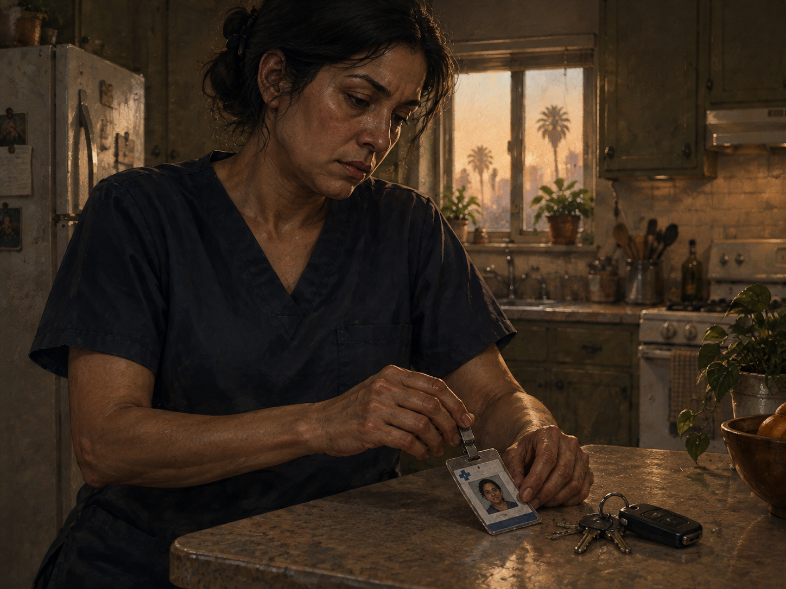
</figure>
"I don't have the energy to fight with you, Justin," she said. She unclipped her badge, setting it on the counter next to her keys. "I'm going to sleep until one o'clock. When I wake up, you better have figured out how you're going to fix this with that boy. You do not hide in this house."

"Okay," I said.

***

<figure>
  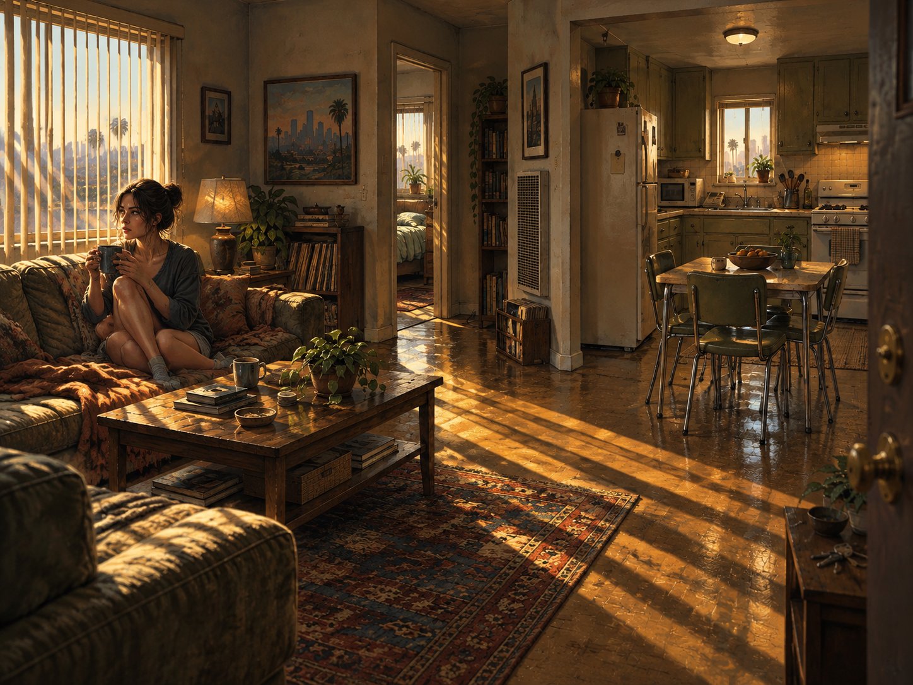
</figure>
By eight-thirty, the morning sun was up, cutting sharp yellow squares through the blinds in my bedroom.

<figure>
  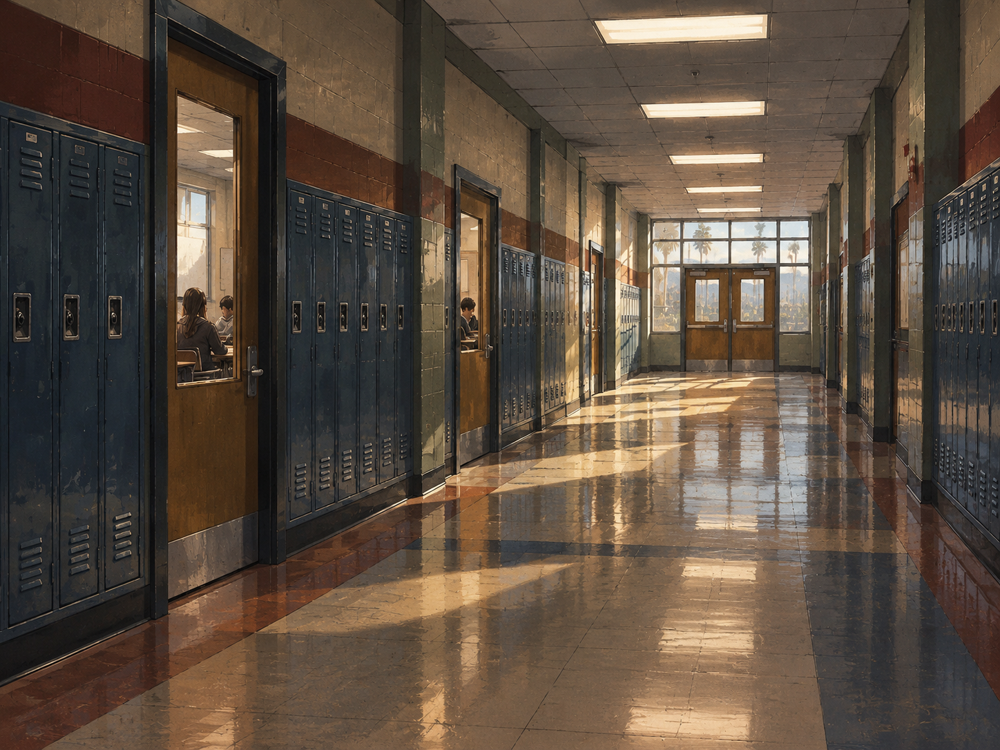
</figure>
Outside, the neighborhood was still. The regular morning rush of yellow school buses and sedans had passed. Dylan and Tyler were in Chemistry; Samira was in AP European History; Andrew was somewhere in the AP wing; and Marcus was sitting at home with three stitches in his mouth.

<figure>
  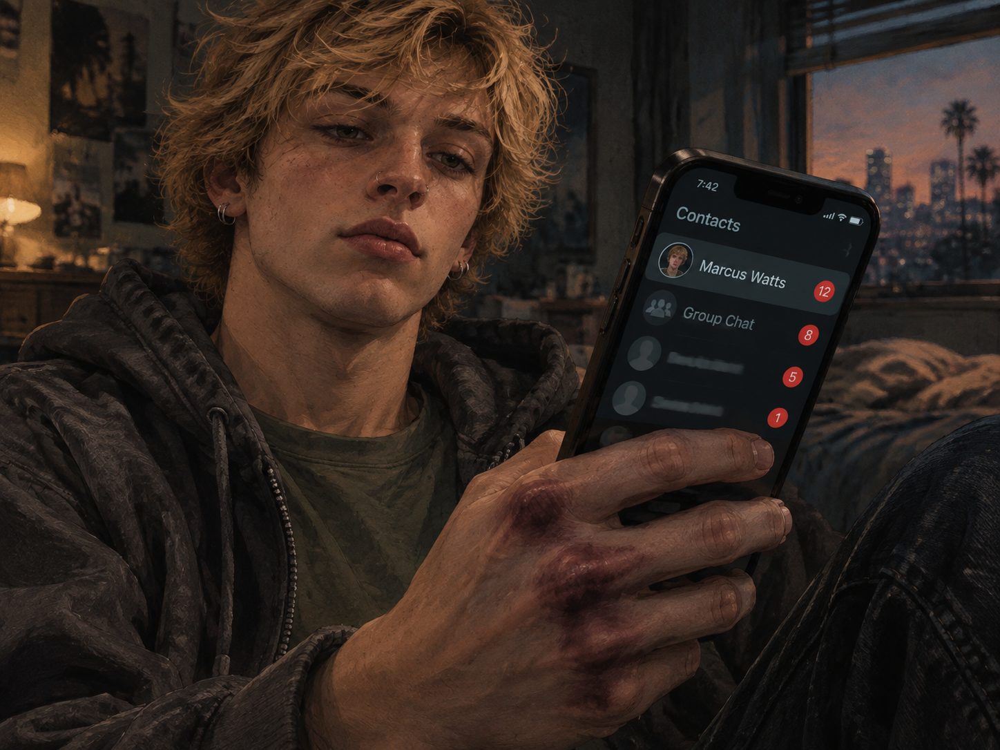
</figure>
I sat on the edge of my bed with my phone in my hand.

The screen showed five unread group texts from Dylan and two direct messages from Tyler. I didn't open them. At the top of my contacts list, Marcus's name sat untouched.

Samira's warning was still clear in my head: *Don't text him. If you text him an excuse, you're dead to all of us.*

She was right. A text was a coward's exit. You could polish the adjectives and hit send from behind a screen. You didn't have to look at the damage you did with your own knuckles.

<figure>
  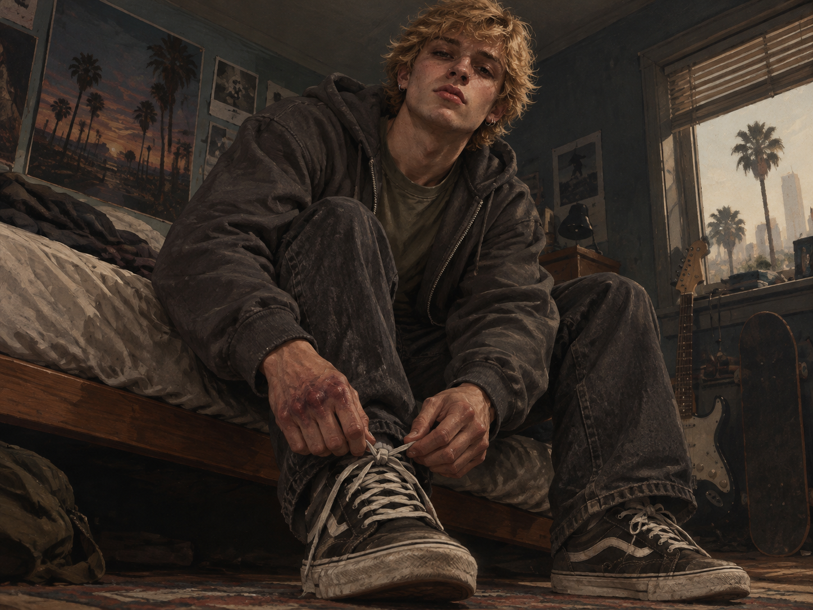
</figure>
I pulled on a clean hoodie, tied my sneakers, and walked out the front door.

<figure>
  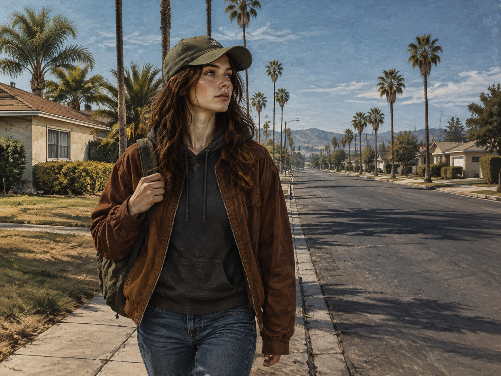
</figure>
The morning air was crisp with the early December breeze. Walking through the neighborhood at nine in the morning during a school day felt unnatural, like walking through an empty movie set. Marcus lived six blocks north, on the corner of Elm and Valencia.

<figure>
  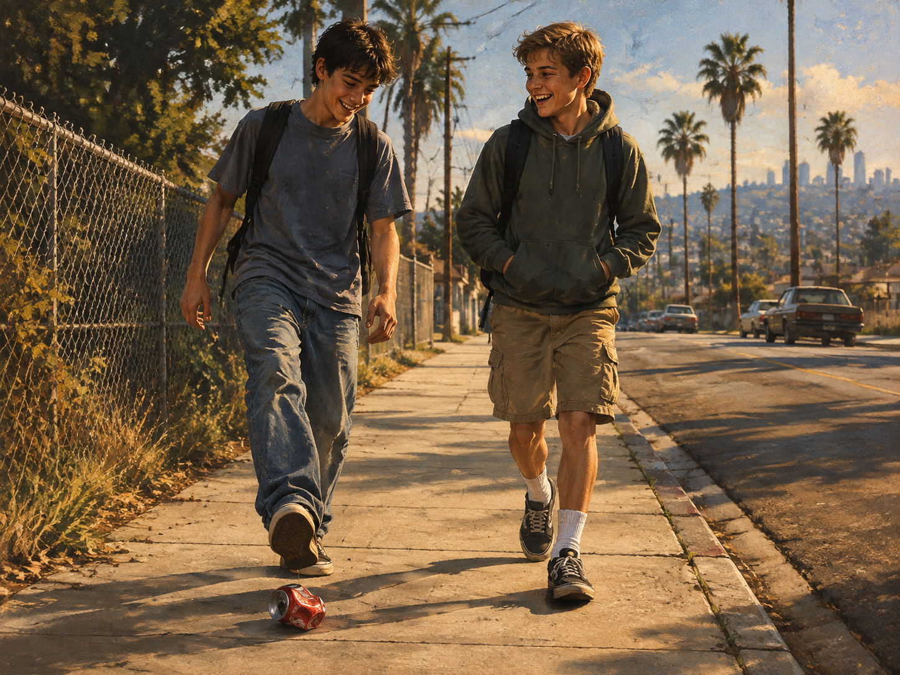
</figure>
I knew every crack in the pavement along that route. In middle school, we used to kick crushed soda cans along these sidewalks, seeing who could keep a can moving without letting it roll into the gutter. Every block I passed felt heavier than the last, my right hand shoved deep into my pocket, throbbing against the fabric.

<figure>
  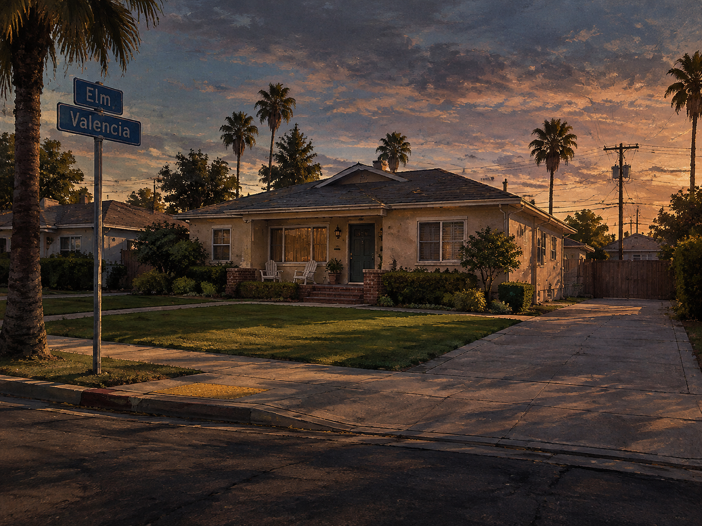
</figure>
When I turned onto Valencia, Marcus's house came into view: a single-story stucco house with a neat lawn and a short brick porch. His mom's Civic was gone, meaning she was downtown at work.

I walked up the concrete path. My sneakers felt like lead weights.

<figure>
  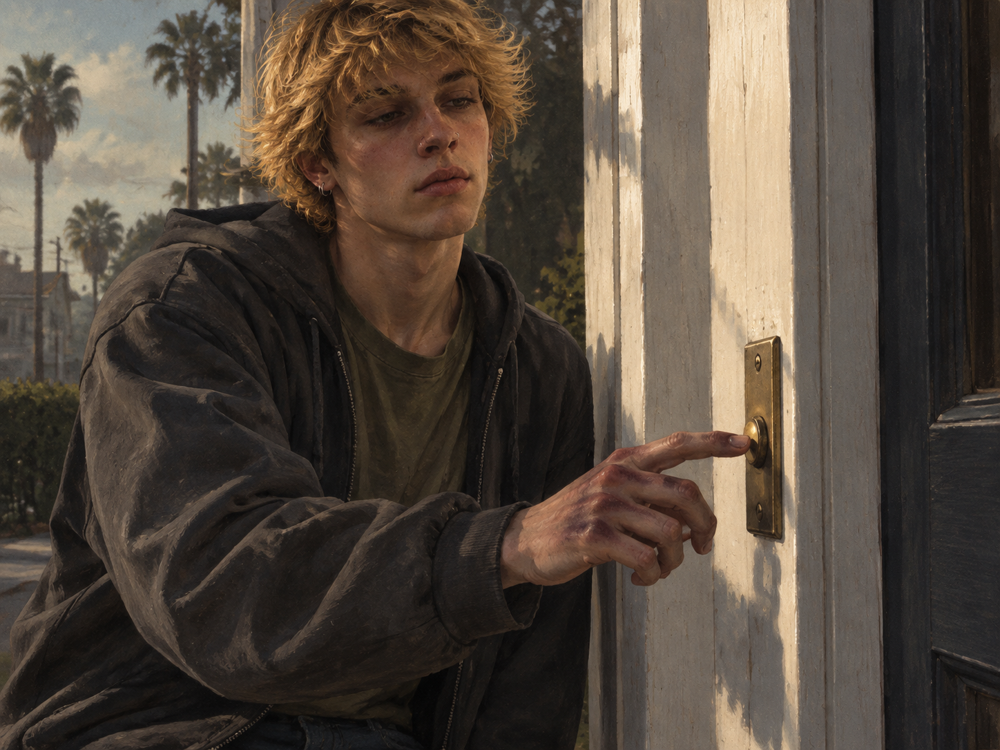
</figure>
I stood on the porch for thirty seconds, staring at the brass doorbell. My heart hammered against my ribs. Every instinct screamed at me to turn around, run back to my apartment, and wait until the suspension blew over. It would be so much easier to let time blunt the sharp edges of humiliation.

That was what I always did. I deflected, I joked, I waited for things to dissolve.

I reached out with my left hand and pressed the bell.

The chime rang inside, two hollow tones echoing through the hallway.

<figure>
  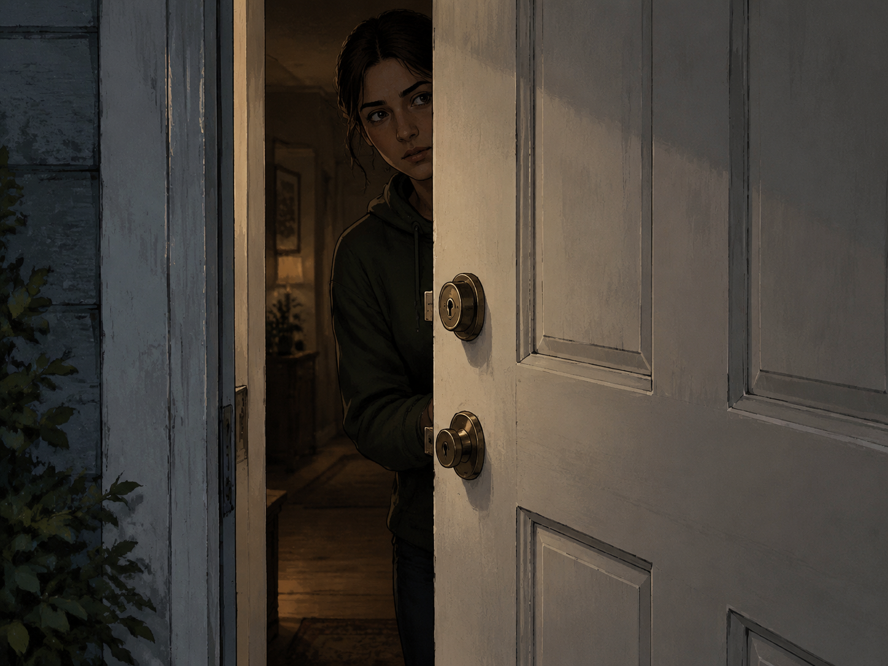
</figure>
A floorboard creaked. Then came the sound of deadbolts unlocking: top lock, bottom lock.

The door pulled inward. Marcus stood in the doorway.

He wore a faded gray crewneck and dark sweatpants. His hair was messy from sleep. But my eyes immediately locked onto the left side of his face.

<figure>
  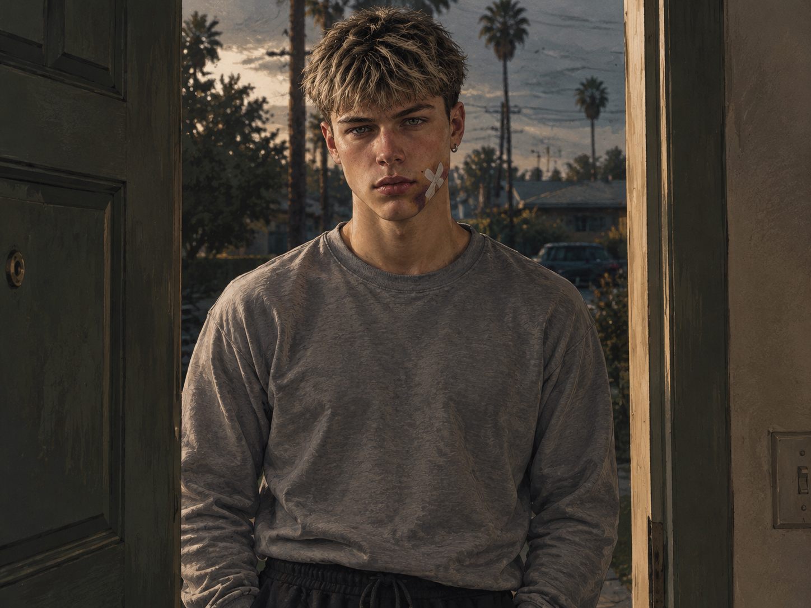
</figure>
Along his lower jawline, a thick white butterfly bandage was taped against his skin. Around the edges of the tape, the skin was a mottled blend of yellow and dark purple. His lower lip was slightly split on the left side, swollen thick, with dark dried blood visible near the crease.

He didn't speak. He just stood there, looking at me with steady, unreadable eyes.

"Hey," I managed to say.

"Hey," Marcus said. His voice sounded tight, his jaw barely moving to avoid stretching his cheek.

"Can I talk to you for a second?" I asked. "On the porch. You don't have to let me inside."

<figure>
  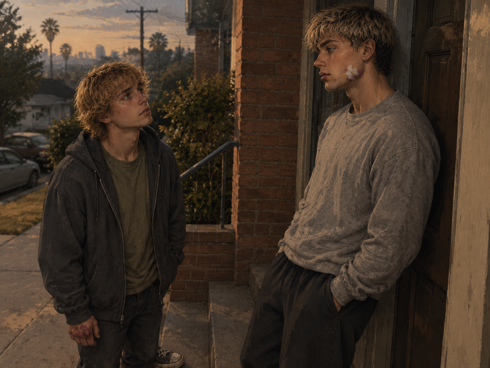
</figure>
Marcus looked past me toward the empty street, then stepped onto the porch, leaning back against the wooden doorframe.

"Go ahead," he said.

<figure>
  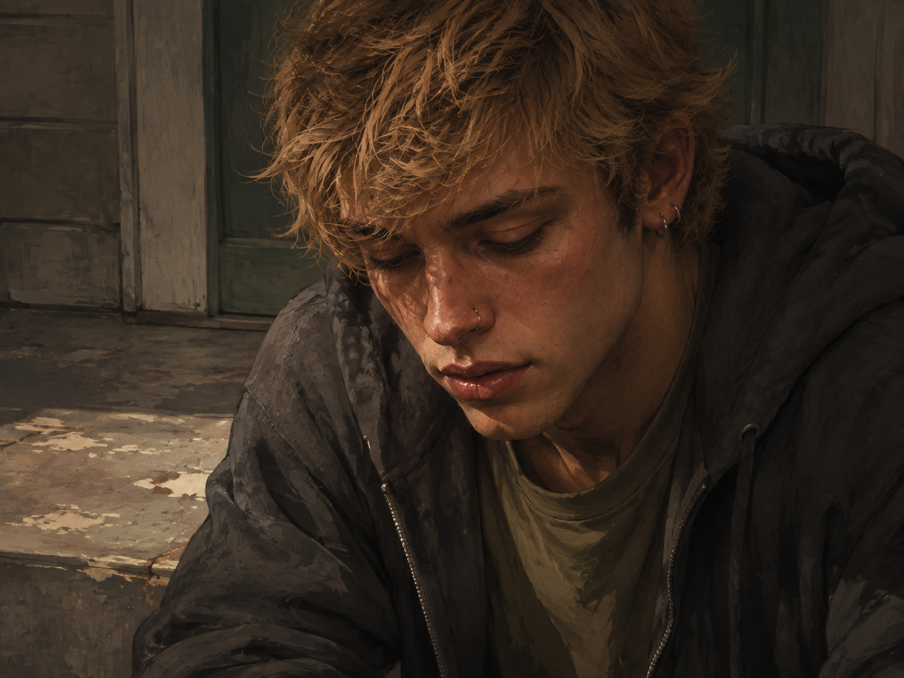
</figure>
I looked down at the concrete between our shoes.

"I'm not here to give you an excuse," I said. "There isn't one."

Marcus didn't move.

"I found out on Thursday night that Andrew had someone," I said, keeping my eyes fixed on the ground. "Someone from his old school. He told me, and I lost my mind. I didn't sleep for two days. And instead of dealing with the fact that Andrew lied to me, I started looking for someone to blame."

I swallowed hard, forcing myself to look up into Marcus's face.

"I remembered how you asked about him in Government," I said. "I remembered how the table went quiet when Andrew got my number. I convinced myself that you were the one he was seeing. I built this whole insane story where you two were laughing at me. It was delusional, and selfish, and the most cowardly thing I've ever done."

Marcus's expression remained completely flat.

"When I saw you in the cafeteria," I continued, "I wasn't thinking. I just wanted someone to hurt the way I was hurting. And you were sitting right there, and you had done nothing to me. You've never done anything except be a good friend for nine years."

<figure>
  
</figure>
I pulled my right hand out of my hoodie pocket. The bruised knuckles were exposed in the bright sunlight.

"I'm sorry, Marcus," I said. "I know saying sorry doesn't fix your face. But I needed to say it to you directly, without a screen, without Dylan or Samira around. You didn't deserve any of that."

A breeze rustled the dry leaves of the magnolia tree by the lawn.

<figure>
  
</figure>
Marcus brought two fingers up and lightly touched the edge of the medical tape on his jaw, wincing slightly.

"You're right about one thing," Marcus said, his voice flat. "It was stupid."

"I know."

"You looked like an idiot," Marcus said. "You walked across that room, yelled my name, and threw the worst punch I've ever seen. Look at your hand. You bruised your own knuckles because you don't even know how to make a fist."

I looked down. "Yeah."

"I lied to Davies," Marcus said. "I told him I slipped on spilled milk near the tray return."

"Samira told me."

<figure>
  
</figure>
"I didn't do it because we're good, Justin," Marcus said. He looked straight at me, and for the first time, I saw the cold anger underneath his calm exterior. "I did it because your mom works two jobs to keep you in school, and if you get an assault charge on your record, you're done. You lose your diploma, you lose financial aid, you get sent to alternative ed. I'm not letting nine years get flushed down the toilet because you had a three-day breakdown over a transfer kid who doesn't even know who he is."

The words hit me square in the chest, hard and clean. There was no cruelty in his tone, only pure reality.

"Andrew came to me in September," Marcus added quietly. "He asked for your number. He told me not to tell you because he wanted to handle it himself. I gave it to him because I thought he was an awkward rich kid trying to make a friend. That was my mistake. I should have told you. But instead of asking me a single question, you swung on me in the cafeteria."

"I know. I'm sorry."

Marcus stared at me for another long moment. The tension hung heavy, but the venom had drained out of it.

"My mom's making soup tonight," Marcus said, turning slightly toward the door. "She told me if you show up here before Friday, she's going to hit you with a broom."

A tiny sound caught in my throat. The crushing pressure in my ribs loosened by a fraction.

"Tell her I understand," I said.

Marcus put his hand on the screen door handle. "Go home, Justin. Put some ice on your hand. And don't text the group chat until tomorrow. Let Dylan calm down first."

"Okay," I said.

<figure>
  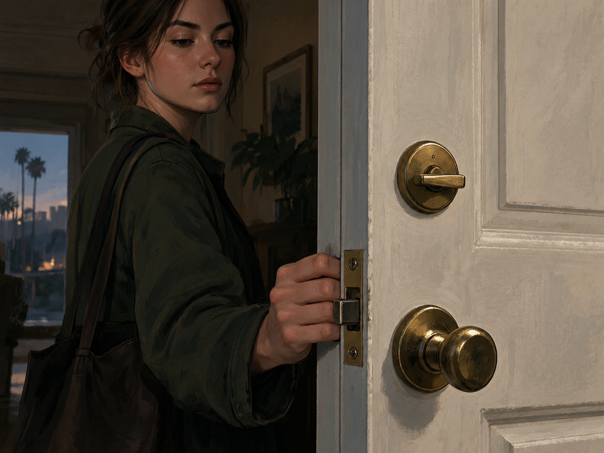
</figure>
Marcus stepped back inside. He pulled the door shut until the latch clicked, leaving the deadbolt unlocked.

I stood on the porch for a moment, looking at the white door.

The air was cold, and my hand still throbbed, and nothing was instantly fixed. We weren't going to play video games this afternoon, and we weren't going to walk to school together on Friday like nothing had happened. The scar inside his mouth would take weeks to heal, and the trust between us would take even longer.

But the silence was broken.

<figure>
  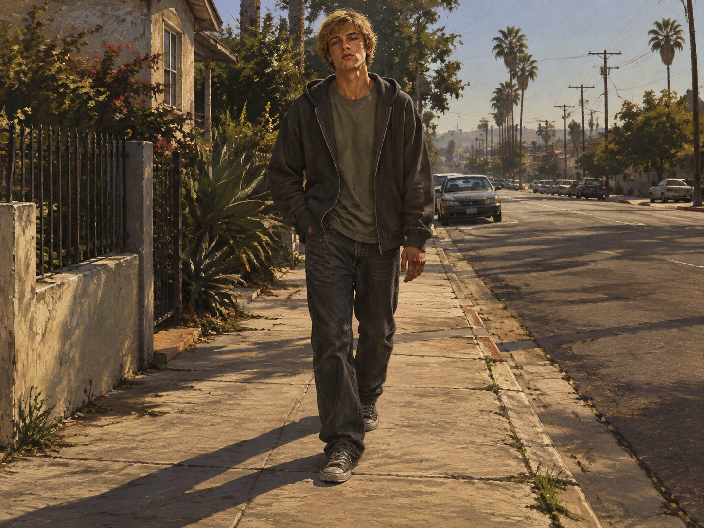
</figure>
I turned around, stepped off the porch, and started the long walk home.
